+++
title = 'Nellie News #1'
date = 2026-07-22T20:56:51+01:00
draft = true
+++

Hi beautiful bugs,  
This is my first try writing a newsletter!

I'm happy to share a little overview of the different projects I'm working on.

## Drawing
Hobbies are coming very much in waves. I've been happy to wander outside sometimes again, or killing time alone at cozy cafes, sometimes striking up conversation with strangers. I feel a bit detached from drawing again here. However, I don't think bad art exists when it helps you work through emotions. Anyhow, here I'm getting a bit back in the flow!
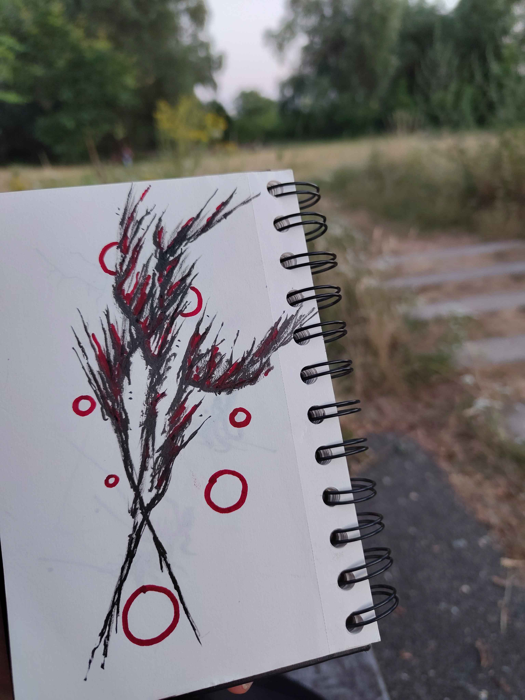
I also really love the idea of condensed energy. Compacted consciousness, atomicity or the smallest something can possibly get. When you see big red circles in a drawing that's usually me trying to become a wizard. If you haven't watched Neon Genesis Evangelion I would really recommend it, even if it is kinda slow and confusing. BIG ALIEN MECH CORES.
Anyhow, here are some little cores, or someone said a knee.
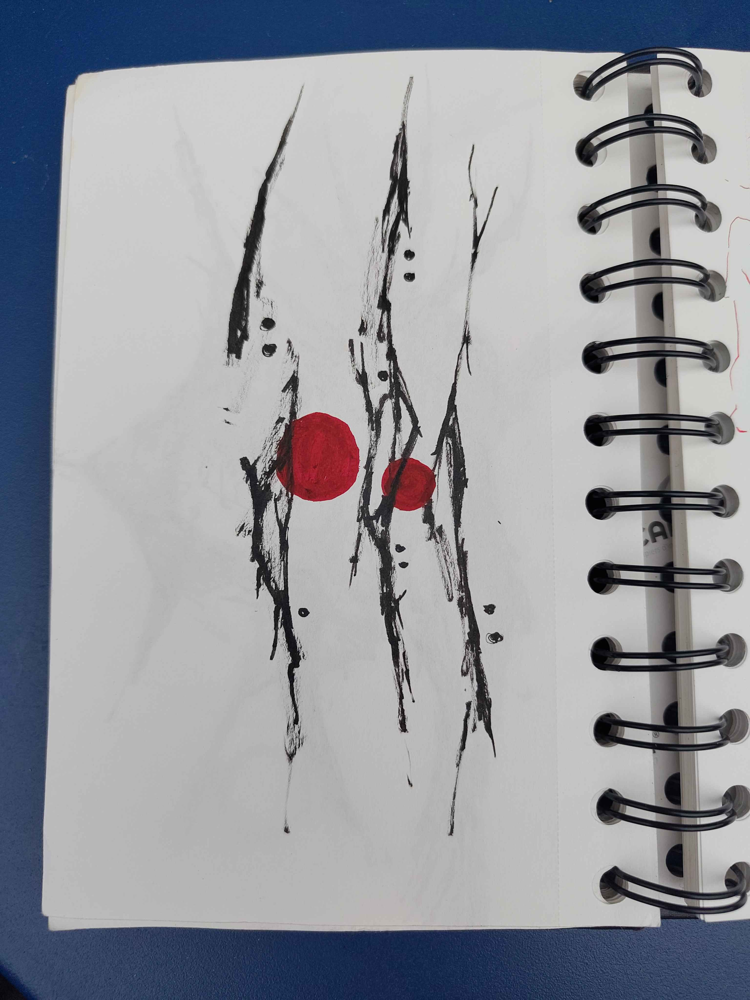
Art swaps! This is an art swap with Bave on our first date! They love flowers so I often call them flower :3 Their art book paper had a really fun texture, I want to explore textures of different mediums more! I also tried to add little cute highlights, I like the happy sparkles, I feel like I'm collecting people's ideas and taking them on a trip on my own explorations alongside me :)
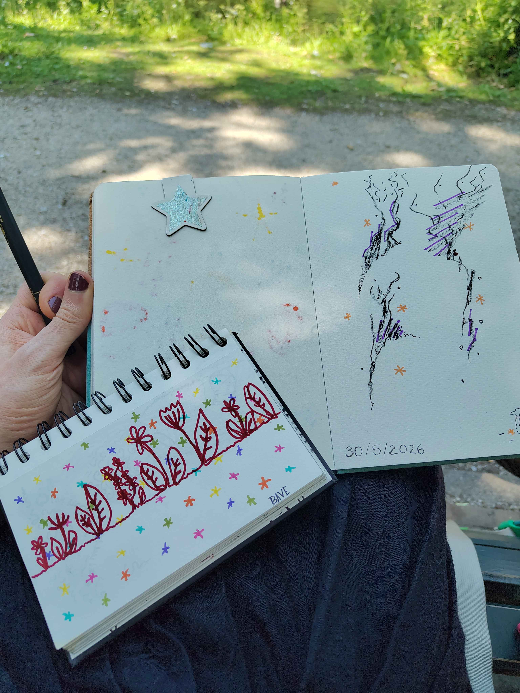
In Copenhagen! I went to a queer bookstore to test my luck. And there was Kosai, drawing on her comic! She was so eager to show me around and have a cozy chat! We ended up doing an art swap and she wrote me a little haiku inspired by how my pens and gloves had ended up on the table :) 
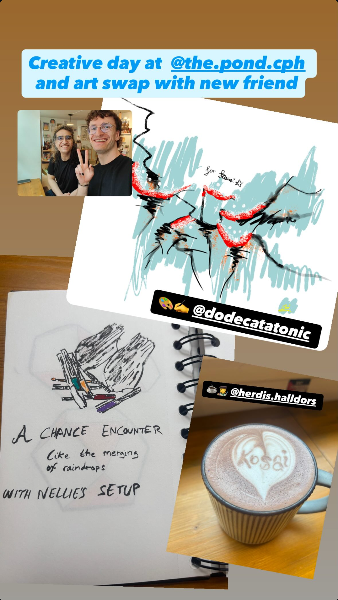
Last week at the Queer Munch, I did another art swap again yay! I did not talk very much with her, but I like the little gift to a stranger
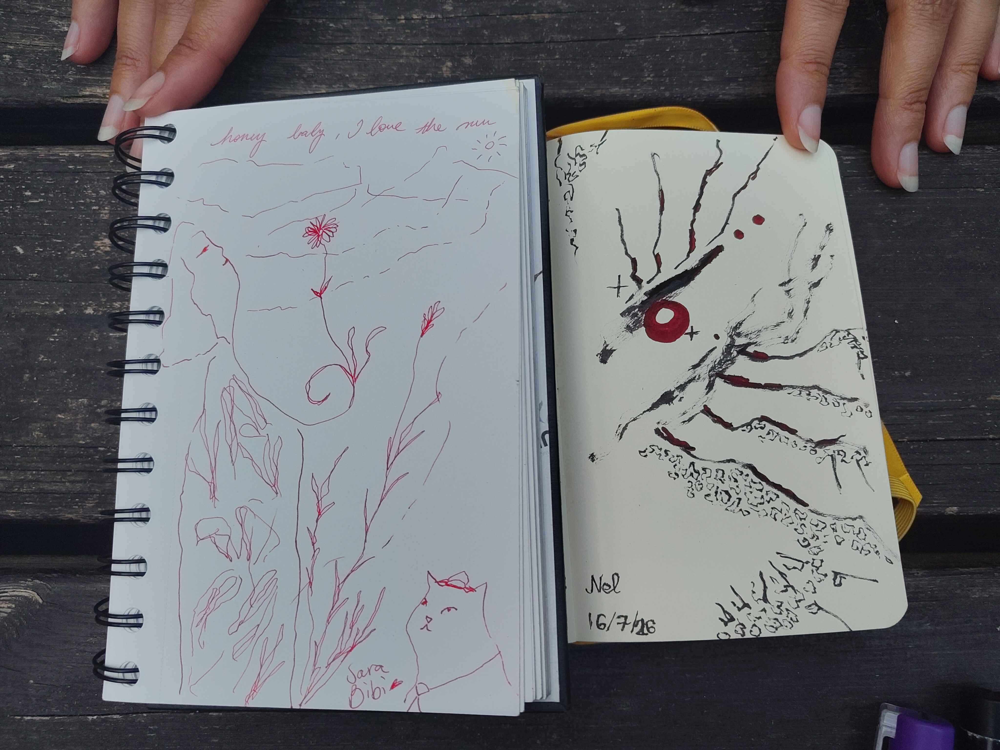

## Crystals
I've been working on a crystal growth simulator, and of course, got sidetracked by pretty random algorithms.  
At first I created a way to 'stitch' little piramids together. These would be the basis to get more complex shapes.
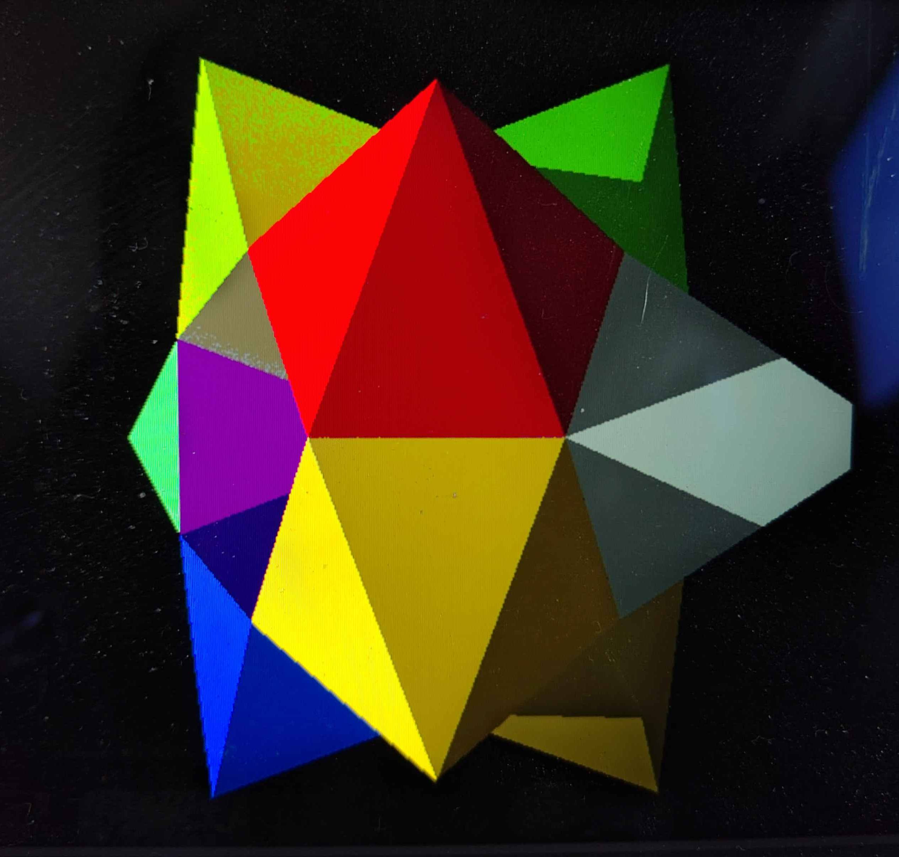
Next, I switched to an external viewer because I was trying to do too many things at once. That saved me some time :)
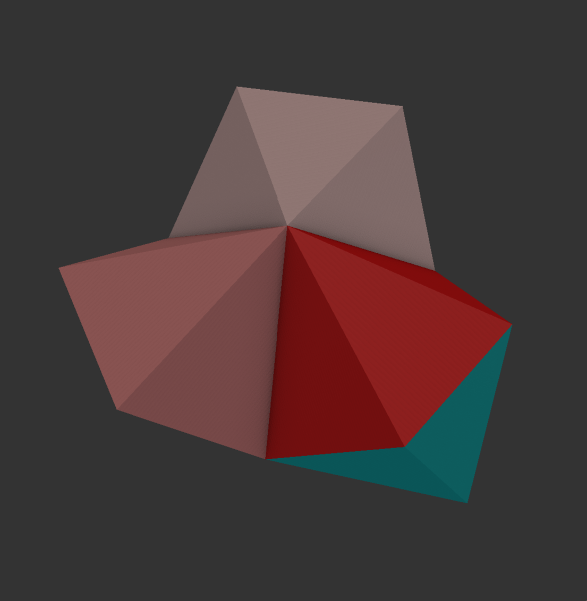
( I can also generate graphs which relate to the shape you see! This one matches the one above )
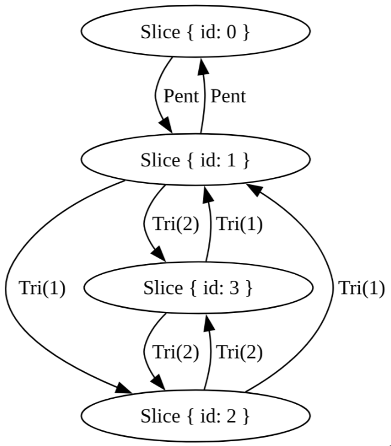  
We have a more complex structure!
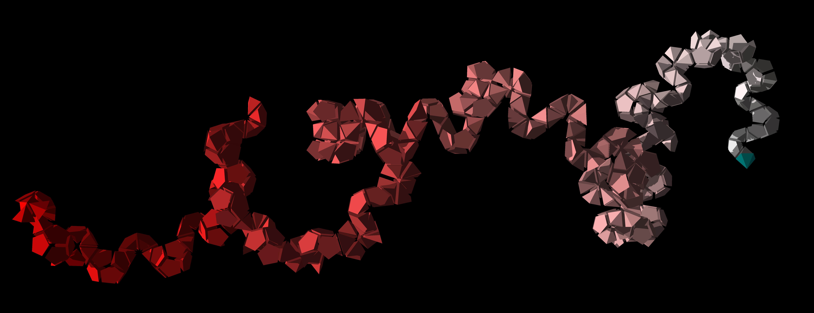
A more complex structure!
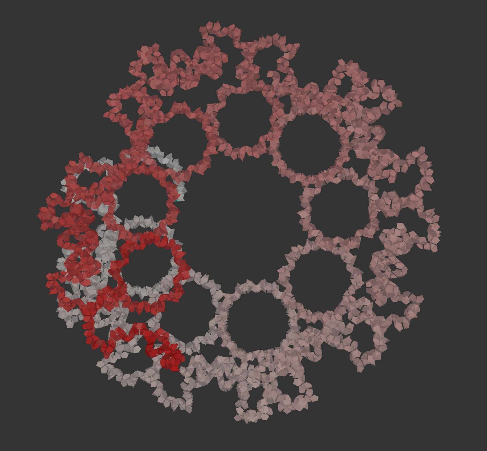
A more complex structure!
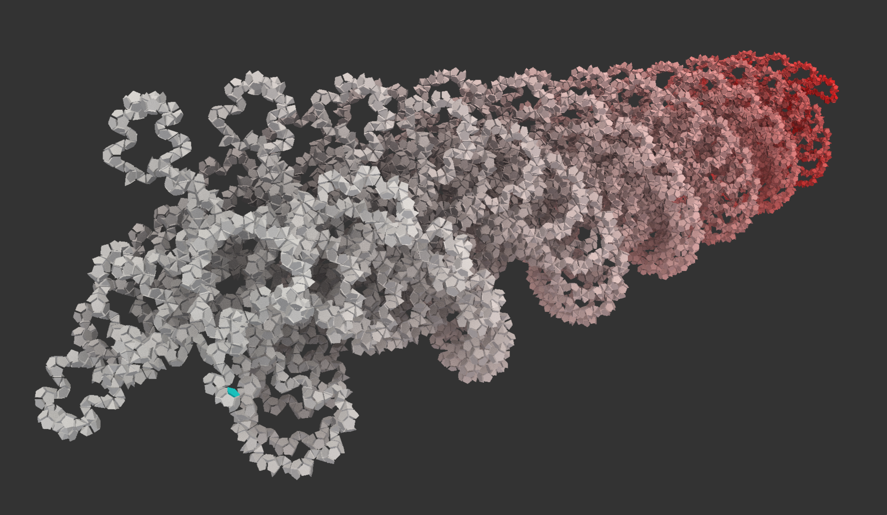
A more complex structure!
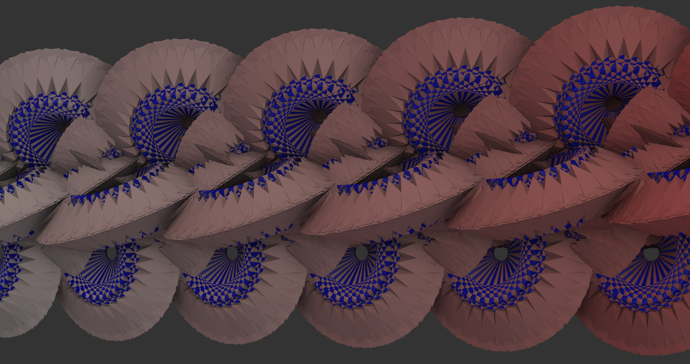

## Synth

I've been continueing on my [software synthesizer](https://github.com/n-e-l/synth)! This let's me compute audio signals on the graphics card, and investigate the resulting soundwaves visually.

The goal is to, one day, create some algorithmic music with accompanying algorithmic visuals!

Left you see the soundwaves, right is the code generating it. There are also knobs/sliders to play with the sounds!

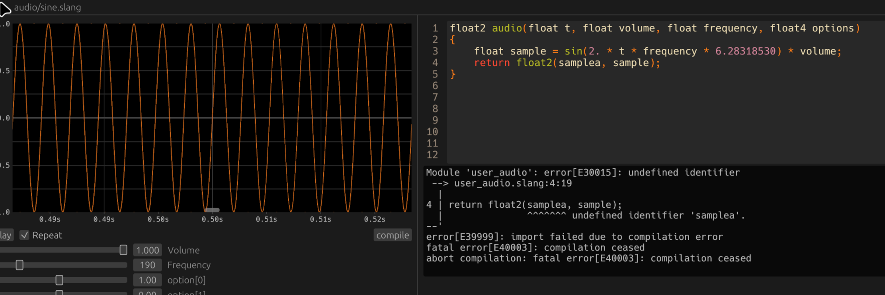

Here I have cleaned it up a little, rewrote the graph renderer (400x faster!), and made a cute sound effect :)
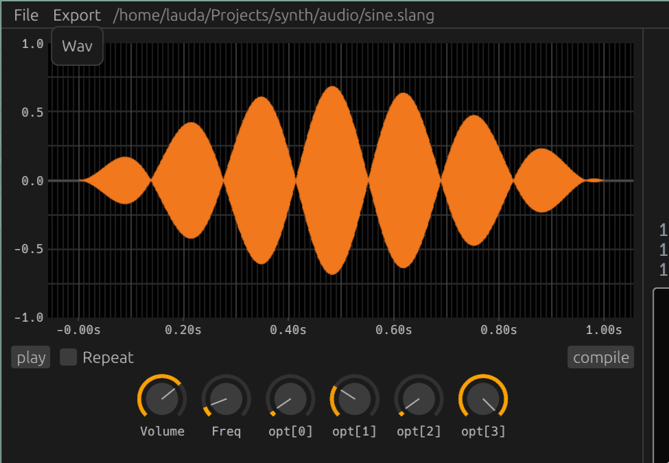


